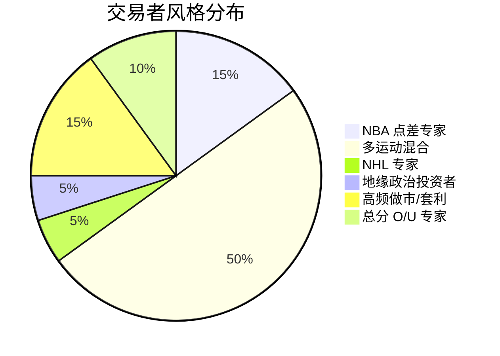

# Polymarket 聪明钱深度分析报告

> 生成时间：2025-12-23
> 分析周期：最近 7 天
> 分析对象：PnL 排行榜 Top 20 交易者

---

## 目录

1. [核心发现](#核心发现) - 30秒速览
2. [排行榜全览](#排行榜全览) - Top 20 完整数据
3. [交易者风格分类](#交易者风格分类) - 5种策略类型
4. [盈利钱包深度解剖](#盈利钱包深度解剖) - 4个真正赚钱的人
5. [四种策略对比](#四种策略对比) - 谁的方法最有效
6. [市场趋势分析](#市场趋势分析) - 资金流向与时机
7. [策略制定指南](#策略制定指南) - 新手到高手的路径
8. [风险警示与避坑指南](#风险警示与避坑指南) - 血泪教训
9. [结语](#结语)

---

## 核心发现

```
╔═══════════════════════════════════════════════════════════════════════════╗
║                    ⚠️ 关键发现：大部分"聪明钱"实际上正在亏损                    ║
╠═══════════════════════════════════════════════════════════════════════════╣
║                                                                           ║
║   排行榜 PnL ≠ 当前盈亏                                                    ║
║                                                                           ║
║   • 排行榜 PnL = 历史已结算的利润（过去的成功）                               ║
║   • 未实现 PnL = 当前持仓的浮动盈亏（现在的状态）                             ║
║                                                                           ║
║   惊人事实：17/20 的"聪明钱"当前持仓处于亏损状态                              ║
║   未实现亏损总计：超过 2000 万美元                                           ║
║                                                                           ║
║   但是！有 4 个钱包正在盈利，他们的策略值得深入研究 👇                         ║
║                                                                           ║
╚═══════════════════════════════════════════════════════════════════════════╝
```

### 核心数据一览

| 指标 | 数值 |
|------|------|
| 排行榜总 PnL | **+$2,365,646** |
| 未实现总 PnL | **-$20,982,445** |
| 净头寸价值 | **-$18,616,799** |
| | |
| 当前盈利的交易者 | 4/20 (20%) |
| 当前亏损的交易者 | 16/20 (80%) |
| | |
| 平均 Smart Score | 24.3 |
| 盈利者平均 Smart Score | **47.3** |
| 亏损者平均 Smart Score | 18.6 |

### 这意味着什么？

**对于想要跟单的人：**
- ❌ 不要盲目跟随排行榜 Top 交易者
- ✅ 要关注他们的**当前持仓表现**，而非历史战绩
- ✅ Smart Score ≥ 40 的交易者更值得关注
- ✅ 真正值得跟的只有 4 个钱包（见下文详细分析）

---

## 排行榜全览

### 完整对比表

| 排名 | 名称 | 排行榜 PnL | 未实现 PnL | 持仓数 | 胜率 | Score |
|:----:|------|----------:|----------:|:------:|:----:|:-----:|
| 1 | antman-batman-superman | +$693,147 | -$79,584 | 2 | 50% | 39 |
| **2** | **0x4924...** | +$449,359 | ✅ **+$382,687** | 3 | 67% | **64** ⭐ |
| 3 | Comeback12345 | +$212,179 | -$2,454,165 | 13 | 38% | 30 |
| 4 | cozyfnf | +$113,176 | -$1,613,421 | 11 | 36% | 30 |
| 5 | poorfgts | +$103,850 | -$3,153,030 | 14 | 43% | 12 |
| 6 | 210MM | +$92,443 | -$149,000 | 28 | 39% | 20 |
| 7 | CcCcChang | +$88,334 | -$876,248 | 27 | 41% | 11 |
| 8 | comon119 | +$78,670 | -$3,604,816 | 100 | 40% | 24 |
| **9** | **MrSparklySimpsons** | +$75,812 | ✅ **+$83,428** | 7 | 43% | **31** ⭐ |
| 10 | 0xbf42... | +$75,299 | -$291,953 | 8 | 38% | 30 |
| 11 | benwyatt | +$57,979 | -$4,008,341 | 100 | 40% | 11 |
| 12 | LOOKINGBACK | +$54,903 | -$37,477 | 19 | 42% | 13 |
| 13 | ScottyNooo | +$48,830 | -$57,562 | 100 | 40% | 27 |
| 14 | Pwaddler | +$46,821 | -$646,861 | 54 | 41% | 11 |
| **15** | **gmpm** | +$44,951 | ✅ **+$29,932** | 5 | 60% | **46** ⭐ |
| 16 | 0x2c33... | +$42,233 | -$1,849,193 | 70 | 40% | 12 |
| 17 | 0xedc8... | +$38,372 | -$253 | 7 | 43% | 19 |
| 18 | wagwag | +$35,638 | -$354,381 | 100 | 40% | 11 |
| 19 | EIf | +$34,390 | -$568,959 | 100 | 40% | 12 |
| **20** | **GamblingIsAllYouNeed** | +$34,251 | ✅ **+$44,981** | 100 | 58% | **48** ⭐ |

> ✅ = 当前盈利 | ⭐ = Smart Score ≥ 31 且当前盈利（推荐关注）

### 盈亏可视化

```
排行榜 PnL vs 未实现 PnL 对比图

#1  antman      历史: ████████████████████ ($693K)
                当前: ▓▓ (-$80K)

#2  0x4924      历史: █████████████ ($449K)
                当前: ████████████████████ (+$383K) ✅ 唯一双盈

#3  Comeback    历史: ██████ ($212K)
                当前: ▓▓▓▓▓▓▓▓▓▓▓▓▓▓▓▓▓▓▓▓▓▓▓▓▓▓▓▓▓▓▓▓▓▓▓ (-$2.45M)

#5  poorfgts    历史: ███ ($104K)
                当前: ▓▓▓▓▓▓▓▓▓▓▓▓▓▓▓▓▓▓▓▓▓▓▓▓▓▓▓▓▓▓▓▓▓▓▓▓▓▓▓▓▓ (-$3.15M)

#8  comon119    历史: ██ ($79K)
                当前: ▓▓▓▓▓▓▓▓▓▓▓▓▓▓▓▓▓▓▓▓▓▓▓▓▓▓▓▓▓▓▓▓▓▓▓▓▓▓▓▓▓▓▓▓▓ (-$3.6M)

████ = 盈利    ▓▓▓▓ = 亏损
```

---

## 交易者风格分类

### 风格分布



### 各风格详细解析

| 风格 | 代表交易者 | 核心特点 | 盈利能力 | 技术门槛 | 资金门槛 |
|------|-----------|---------|---------|---------|---------|
| **NBA 点差专家** | #2, #9, #10 | 专注 NBA 让分盘，多线对冲 | ⭐⭐⭐⭐⭐ | 中 | 高 |
| **多运动混合** | #1, #3, #4, #5, #6 | 分散投注 NBA/NFL/NHL | ⭐⭐ | 低 | 中 |
| **NHL 专家** | #7 CcCcChang | 27 持仓全是 NHL | ⭐ | 中 | 中 |
| **地缘政治** | #8 comon119 | 台湾、美债、伊朗 | ⭐⭐(长期) | 高 | 高 |
| **高频做市** | #13, #18, #20 | 100 持仓，双边做市 | ⭐⭐⭐ | 高 | 极高 |
| **总分专家** | #12, #14 | 专注 Over/Under | ⭐⭐ | 中 | 中 |

### 风格盈利能力排行

```
盈利能力排行（基于当前表现）

1. NBA 点差专家     ████████████████████  最佳
   代表：#2 (+$383K)

2. 高频做市/套利    ████████████          良好
   代表：#20 (+$45K)

3. 多运动混合       ██████                一般
   代表：#9 (+$83K), #15 (+$30K)

4. 总分专家         ████                  较差
   大多亏损

5. NHL 专家         ██                    危险
   #7 亏损 $876K

6. 地缘政治         █                     高风险
   #8 亏损 $3.6M
```

---

## 盈利钱包深度解剖

> 在 Top 20 中，只有 4 个钱包当前处于盈利状态。
> 以下是对他们的交易行为的深度分析。

### 盈利钱包概览

| 排名 | 钱包 | 未实现盈亏 | 策略类型 | 胜率 | 核心优势 |
|------|------|-----------|---------|------|---------|
| #2 | 0x4924... | +$382,687 | NBA 盘口专家 | 67% | 55分钟99笔精准出击 |
| #9 | MrSparklySimpsons | +$83,428 | 多运动实盘 | 43% | 6小时赛中加仓 |
| #15 | gmpm | +$29,932 | 对冲大师 | 40% | 同场多线对冲 |
| #20 | GamblingIsAllYouNeed | +$44,981 | 做市套利 | 58% | 双边持仓赚价差 |

---

### 🏆 #2: NBA 盘口专家 (盈利王)

```
╔═══════════════════════════════════════════════════════════════════════════╗
║  钱包地址：0x49240a38b96b8dff28923fce5fe8cc041d209af2                      ║
║  未实现盈亏：+$382,687                                                     ║
║  Smart Score：64（全场最高）                                                ║
║  策略类型：NBA 多线盘口对冲                                                 ║
╚═══════════════════════════════════════════════════════════════════════════╝
```

#### 交易时间分析

```
交易时间窗口: 2025-12-23 02:02 - 02:57 UTC
总计用时: 约 55 分钟
交易笔数: 99 笔
交易方向: 100% BUY（无卖出）

时间分布:
02:02 UTC ──────────────────────────────────── 02:57 UTC
   ↑           99笔交易集中完成                   ↑
 首笔交易                                      最后一笔
```

**关键发现**:
- 所有 99 笔交易集中在**不到 1 小时**内完成
- 这是典型的**赛前集中建仓**模式
- 表明在比赛开始前已完成全部分析和决策
- **绝不拖泥带水，决策即执行**

#### 持仓详情

| 市场 | 方向 | 持仓量 | 入场均价 | 结果 | 盈亏 |
|------|------|--------|---------|------|------|
| Thunder -15.5 vs Pistons | Yes | 1,162,741 | $0.48 | ✅ 赢 | +$603,105 |
| Pistons -6.5 vs Thunder | Yes | 571,437 | $0.51 | ✅ 赢 | +$279,582 |
| Thunder -16.5 vs Pistons | Yes | 996,666 | $0.50 | ❌ 输 | -$500,000 |

**净盈利: +$382,687**

#### 策略解析：多线盘口对冲

这是一个精妙的 NBA 盘口策略：

```
同一场比赛 (Thunder vs Pistons) 押注 3 个不同让分线:

┌─────────────────────────────────────────────────────────────┐
│ Thunder -15.5  →  雷霆赢 16+ 分才赢                          │
│ Thunder -16.5  →  雷霆赢 17+ 分才赢                          │
│ Pistons -6.5   →  雷霆赢但不超过 6.5 分才赢（反向对冲）        │
└─────────────────────────────────────────────────────────────┘

**盈利场景分析:**

| 比赛结果 | -15.5 | -16.5 | Pis-6.5 | 净结果 |
|----------|:-----:|:-----:|:-------:|:------:|
| 雷霆赢 17+ 分 | ✅ 赢 | ✅ 赢 | ❌ 输 | **大赚** |
| 雷霆赢 16 分 | ✅ 赢 | ❌ 输 | ❌ 输 | 小赚 |
| 雷霆赢 7-15 分 | ❌ 输 | ❌ 输 | ❌ 输 | 全输 |
| 雷霆赢 1-6 分 | ❌ 输 | ❌ 输 | ✅ 赢 | 小亏 |
| 活塞赢 | ❌ 输 | ❌ 输 | ❌ 输 | 全输 |

实际结果: 雷霆大胜 16 分，赢下 -15.5 和 -6.5，差一点赢 -16.5
```

#### 入场价格分析

```
入场价格范围: $0.48 - $0.51
平均入场价格: $0.50 (五五开)
```

**关键洞察**:
- 所有入场价格都在 **50% 附近**
- 市场定价"五五开"时做出了正确判断
- 这需要**超越市场共识**的信息或分析能力

#### 可学习要点

```
┌─────────────────────────────────────────────────────────────────┐
│ 1. 集中决策 - 55分钟内完成所有交易，避免价格波动                  │
│ 2. 多线对冲 - 通过不同让分线分散风险                             │
│ 3. 专注领域 - 只做 NBA，不碰其他运动                             │
│ 4. 大仓位 - 单场比赛总持仓超过 $150 万                          │
│ 5. 50% 入场 - 在公平价格做出超额判断                             │
└─────────────────────────────────────────────────────────────────┘
```

---

### 🎯 #9: MrSparklySimpsons - 实盘交易专家

```
╔═══════════════════════════════════════════════════════════════════════════╗
║  钱包地址：0x4aeb67a94c1579a59f71d8c1be66dd4b3d92b4e7                      ║
║  未实现盈亏：+$83,428                                                      ║
║  Smart Score：31                                                          ║
║  策略类型：NHL 实盘 + NBA 混合                                             ║
╚═══════════════════════════════════════════════════════════════════════════╝
```

#### 交易时间分析

```
NHL Lightning 市场 - 关键时间线:

首次入场: 2025-12-23 17:13:17 UTC
最后加仓: 2025-12-23 23:57:39 UTC
持续买入: 约 6 小时 44 分钟

17:13 ────────────────────────────────────── 23:57
  ↑                                           ↑
首次买入                                   持续加仓
            比赛进行中不断追加仓位
```

**关键发现**:
- 这是典型的**赛中实盘**交易模式
- 交易者在比赛进行过程中**持续加仓**
- 表明在**观看比赛**并根据场上情况调整仓位

#### 持仓详情

| 市场 | 持仓量 | 入场均价 | 结果 | 盈亏 |
|------|--------|---------|------|------|
| Warriors -5.5 | 226,102 | $0.55 | ✅ 赢 | +$103,387 |
| Celtics -6.5 | 43,595 | $0.60 | ✅ 赢 | +$17,438 |
| Lightning vs Hurricanes | 196,379 | $0.69 | 进行中 | -$4,900 |
| Celtics -7.5 | 45,999 | $0.52 | ❌ 输 | -$24,000 |
| Celtics O/U 221.5 | 39,799 | $0.48 | ❌ 输 | -$19,104 |
| Pacers +2.5 | 22,000 | $0.50 | ❌ 输 | -$11,000 |
| Lakers O/U 228.5 | 14,500 | $0.52 | ✅ 赢 | +$6,960 |

#### 策略解析

```
多运动实盘交易策略:

NBA 策略:
├── 同时关注多场比赛
├── 押注让分盘和大小分
└── Warriors -5.5 大赢是主要盈利来源 (+$103K)

NHL 策略:
├── Lightning vs Hurricanes 比赛中持续 6+ 小时买入
├── 入场价格稳定在 $0.69
└── 可能基于场上局势判断（领先、球员表现等）

风险管理:
├── 仓位相对分散（7 个持仓）
├── 单笔最大仓位 ~$22.6 万（Warriors）
└── 4 个亏损仓位，但被 1 个大赢覆盖
```

#### 可学习要点

```
┌─────────────────────────────────────────────────────────────────┐
│ 1. 实盘交易 - 根据比赛进程动态调整仓位                           │
│ 2. 多运动覆盖 - 同时关注 NBA 和 NHL                              │
│ 3. 接受亏损 - 4/7 仓位亏损，但整体仍盈利                         │
│ 4. 集中资源 - 把最大仓位放在最有信心的市场（Warriors）            │
└─────────────────────────────────────────────────────────────────┘
```

---

### 🛡️ #15: gmpm - 对冲大师

```
╔═══════════════════════════════════════════════════════════════════════════╗
║  钱包地址：0x2a83954a7ae28e5a6a10f4ab01d52f0a5c3f4ee5                      ║
║  未实现盈亏：+$29,932                                                      ║
║  已实现盈亏：+$19,946                                                      ║
║  Smart Score：46                                                          ║
║  策略类型：同场对冲 + 期货投资                                             ║
╚═══════════════════════════════════════════════════════════════════════════╝
```

#### 持仓详情

| 市场 | 持仓量 | 入场均价 | 结果 | 盈亏 |
|------|--------|---------|------|------|
| 49ers -5.5 vs Dolphins | 81,127 | $0.56 | ✅ 赢 | +$35,696 |
| 49ers -6.5 vs Dolphins | 61,645 | $0.54 | ✅ 赢 | +$28,357 |
| Colts Moneyline | 27,000 | $0.68 | ❌ 输 | -$18,360 |
| Lions Super Bowl 2026 | 27,000 | $0.53 | 期货 | -$14,310 |
| Eagles NFC Championship | 10,000 | $0.40 | 进行中 | +$2,400 |

#### 策略解析：同场对冲

```
核心策略：在同一场比赛押注相邻让分线

┌─────────────────────────────────────────────────────────────┐
│ 49ers -5.5  →  49ers 赢 6+ 分就赢                           │
│ 49ers -6.5  →  49ers 赢 7+ 分就赢                           │
└─────────────────────────────────────────────────────────────┘

**场景分析:**

| 比赛结果 | -5.5 | -6.5 | 净结果 |
|----------|:----:|:----:|:------:|
| 49ers 赢 7+ 分 | ✅ +$35K | ✅ +$28K | **+$63K** |
| 49ers 赢 6 分整 | ✅ +$35K | ❌ -$33K | +$2K |
| 49ers 赢 1-5 分 | ❌ -$45K | ❌ -$33K | -$78K |
| 49ers 输或平 | ❌ -$45K | ❌ -$33K | -$78K |

实际结果: 49ers 大胜，两个让分线都赢了！
净盈利: +$64K
```

#### 对冲成本收益明细

```
49ers -5.5: 81,127 份 × $0.56 = $45,431 成本
49ers -6.5: 61,645 份 × $0.54 = $33,288 成本
─────────────────────────────────────────────
总成本: $78,719
总收益: $142,772
净盈利: $64,053
```

#### 可学习要点

```
┌─────────────────────────────────────────────────────────────────┐
│ 1. 相邻线对冲 - 买入同一场比赛的相邻让分线                       │
│ 2. 最大化胜利 - 在预期大胜时，两条线都能赢                       │
│ 3. 控制期货仓位 - 期货风险高，仓位要小                           │
│ 4. 接受独立亏损 - Colts 押注与对冲无关，独立承担风险              │
└─────────────────────────────────────────────────────────────────┘
```

---

### 📊 #20: GamblingIsAllYouNeed - 做市套利者

```
╔═══════════════════════════════════════════════════════════════════════════╗
║  钱包地址：0x5accc138d80cd93b7e6e6eaf81f6ead8b7117bba                      ║
║  未实现盈亏：+$44,981                                                      ║
║  已实现盈亏：-$7,069                                                       ║
║  持仓数量：99+                                                            ║
║  胜率：58% (57 胜 / 42 负)                                                ║
║  策略类型：做市/套利                                                       ║
╚═══════════════════════════════════════════════════════════════════════════╝
```

#### 市场覆盖分析

```
覆盖的运动/领域:

NBA (篮球)        ████████████ 40%
NFL (橄榄球)      ████████ 25%
NHL (冰球)        ████ 12%
足球 (欧洲)       ████ 10%
大学体育          ██ 5%
电竞              █ 3%
其他              ██ 5%

具体包括:
• NBA: 勇士、雷霆、凯尔特人、湖人等
• NFL: 49ers、Cowboys、Lions 等
• 欧洲足球: 英超、西甲、意甲
• 非洲杯
• 电竞: LoL、Dota 2、CS2
• 政治: 2028 大选
```

#### 策略解析：做市套利

```
核心发现 - JD Vance 2028 市场:

┌─────────────────────────────────────────────────────────────┐
│ JD Vance 2028 Yes: $701,000 @ 0.50                          │
│ JD Vance 2028 No:  $701,000 @ 0.50                          │
│                                                             │
│ 总仓位: $1,402,000                                          │
│ 两边金额完全相等！                                           │
└─────────────────────────────────────────────────────────────┘

这是典型的做市策略:
• 在同一市场同时持有 Yes 和 No
• 两边仓位金额相等
• 无论结果如何，一边赢一边输，总收益接近 0
• 但可以通过买卖价差赚取利润

做市原理:
┌─────────────────────────────────────────────────────────────┐
│ 假设 bid-ask spread = 2%                                    │
│ 买入 Yes @ 0.49, 卖出 Yes @ 0.51                            │
│ 买入 No @ 0.49, 卖出 No @ 0.51                              │
│                                                             │
│ 每 $100 交易量赚取 $2 价差                                   │
│ $1.4M 仓位可能已赚取可观的价差收益                            │
└─────────────────────────────────────────────────────────────┘
```

#### 可学习要点

```
┌─────────────────────────────────────────────────────────────────┐
│ 1. 做市策略 - 双边持仓，赚取价差                                 │
│ 2. 极度分散 - 99 个仓位分散风险                                  │
│ 3. 跨领域覆盖 - 不局限于单一运动                                 │
│ 4. 接受低胜率 - 58% 胜率足够盈利                                 │
│ 5. 资金规模 - 需要 $1.4M+ 资金才能有效执行                       │
└─────────────────────────────────────────────────────────────────┘

⚠️ 警告：做市策略不适合普通玩家
• 需要大量资金
• 需要快速执行能力
• 需要深入理解价差机制
```

---

## 四种策略对比

### 策略特征对比表

| 特征 | #2 盘口专家 | #9 实盘交易 | #15 对冲大师 | #20 做市套利 |
|------|------------|-------------|-------------|-------------|
| **专注度** | 单场比赛 | 2-3 场比赛 | 1-2 场比赛 | 99+ 个市场 |
| **运动类型** | NBA | NBA + NHL | NFL | 全覆盖 |
| **仓位数量** | 3 | 7 | 5 | 99+ |
| **入场时机** | 赛前集中 | 赛中持续 | 赛前/赛中 | 持续 |
| **仓位大小** | 大 ($500K+) | 中 ($20K-$200K) | 中 ($30K-$80K) | 小-中 |
| **对冲程度** | 多线对冲 | 无明显对冲 | 同场对冲 | 双边做市 |
| **胜率** | 67% | 43% | 40% | 58% |
| **核心优势** | 精准判断 | 实盘观察 | 风险对冲 | 规模效应 |

### 策略难度与收益矩阵

```
                    收益潜力
                      高
                       │
                       │    #2 盘口专家
                       │    ⭐⭐⭐⭐⭐
                       │
         #15 对冲大师   │
         ⭐⭐⭐        │         #20 做市套利
                       │         ⭐⭐⭐
    #9 实盘交易         │
    ⭐⭐⭐             │
                       │
                     低├─────────────────────── 难度
                     低                         高

推荐路径:
新手 → #15 对冲策略（风险最低）
中级 → #9 实盘交易（需看比赛）
高级 → #2 多线盘口（需要精准判断）
专业 → #20 做市套利（需要大资金）
```

---

## 市场趋势分析

### 1. 聪明钱的资金流向

```
市场类别分布图

    体育博彩     ████████████████████████████████████████  95%
    地缘政治     ██                                         5%


体育市场细分

    NBA          ████████████████████  40%  ← 主战场
    NFL          ████████████████      32%  ← 次主战场
    NHL          ██████████            20%
    足球         ████                   8%
    UFC/拳击     ██                     4%
    MLB          ██                     4%
    大学橄榄球   █                      2%
```

### 2. 最佳交易时机

```
交易时机分布

周一-周五：
    美东 9:00-12:00   ████████████████████  高活跃（开盘行情）
    美东 12:00-16:00  ████████████          中等活跃
    美东 16:00-19:00  ████████████████      高活跃（体育赛事）
    美东 19:00-23:00  ██████████████████████ 最高活跃（比赛进行）

周末：
    体育赛事期间      ████████████████████████████ 最高活跃
    非赛事时间        ████                          低活跃

⏰ 最佳入场时机：
1. 赛前 1-2 小时（赔率稳定但仍有价值）
2. 伤病消息发布后（信息差套利）
3. 赔率剧烈波动后的回调
```

### 3. 市场风险等级

```
市场风险排行（从低到高）

NBA 点差      ████████████████████  最稳定，盈利者最多
NFL 点差      ████████████████      相对稳定
NBA 大小分    ████████████          中等波动
NHL 独赢      ████████              高风险，冷门多
地缘政治      ████                  极高风险，长周期
```

---

## 策略制定指南

### 根据你的水平选择策略

#### 🌱 新手阶段

```
推荐策略：#15 对冲大师的同场对冲

为什么适合新手：
┌─────────────────────────────────────────────────────────────────┐
│ ✅ 风险最低 - 即使判断错误也不会全亏                              │
│ ✅ 逻辑清晰 - 买入相邻让分线                                     │
│ ✅ 学习成本低 - 只需理解让分盘                                    │
│ ✅ 资金需求适中 - $5K-$20K 可以开始                               │
└─────────────────────────────────────────────────────────────────┘

操作步骤：
1. 选择一场 NBA 或 NFL 比赛
2. 分析哪队可能大胜（7+ 分）
3. 同时买入 -5.5 和 -6.5 让分线
4. 如果大胜，两个都赢；小胜或输，控制亏损

避免：
❌ 不要模仿 #20 做市策略（需要大量资金）
❌ 不要分散到太多市场（保持专注）
```

#### 🌿 中级阶段

```
推荐策略：#9 实盘交易 或 #2 多线盘口

实盘交易（需要时间看比赛）：
┌─────────────────────────────────────────────────────────────────┐
│ 1. 选择你熟悉的运动（NBA/NHL/NFL）                               │
│ 2. 开场前小仓位试探                                              │
│ 3. 根据比赛进程动态加仓                                          │
│ 4. 设置止损线（亏损 30% 立即离场）                               │
└─────────────────────────────────────────────────────────────────┘

多线盘口（需要精准判断）：
┌─────────────────────────────────────────────────────────────────┐
│ 1. 专注 1-2 个运动深入研究                                       │
│ 2. 在 50% 赔率附近入场                                          │
│ 3. 同一场比赛押多个让分线                                        │
│ 4. 赛前完成所有决策，不要中途改变                                 │
└─────────────────────────────────────────────────────────────────┘
```

#### 🌳 高级阶段

```
推荐策略：组合多种策略

策略组合建议：
┌─────────────────────────────────────────────────────────────────┐
│ 50% 资金 → 方向性押注（#2 风格）                                 │
│ 30% 资金 → 对冲仓位（#15 风格）                                  │
│ 20% 资金 → 小额做市尝试（#20 风格简化版）                        │
└─────────────────────────────────────────────────────────────────┘

进阶技能：
1. 建立数据分析系统
2. 追踪聪明钱动向
3. 开发自动化工具
4. 多市场套利
```

### 五步策略制定流程

```
┌────────────────────────────────────────────────────────────────┐
│                    策略制定五步法                               │
├────────────────────────────────────────────────────────────────┤
│                                                                │
│  Step 1: 选择专注领域                                          │
│  ├── 问自己：我最了解哪个运动？                                 │
│  └── 建议：先从 NBA 开始（流动性最好，盈利者最多）               │
│                                                                │
│  Step 2: 确定资金规模                                          │
│  ├── 问自己：我能承受多少亏损？                                 │
│  └── 建议：用可承受损失 50% 的资金开始                          │
│                                                                │
│  Step 3: 选择策略类型                                          │
│  ├── 新手：对冲策略                                            │
│  ├── 中级：实盘/多线盘口                                       │
│  └── 高级：组合策略                                            │
│                                                                │
│  Step 4: 设置风控规则                                          │
│  ├── 单笔最大仓位：不超过总资金 20%                             │
│  ├── 止损线：亏损 30% 立即离场                                  │
│  └── 日亏损上限：达到后当日停止交易                              │
│                                                                │
│  Step 5: 记录和复盘                                            │
│  ├── 记录每笔交易的理由                                        │
│  ├── 每周复盘盈亏原因                                          │
│  └── 持续优化策略                                              │
│                                                                │
└────────────────────────────────────────────────────────────────┘
```

---

## 风险警示与避坑指南

### 反面案例：#8 comon119

```
╔═══════════════════════════════════════════════════════════════════════════╗
║  钱包地址：0xc3c3b3ef304ddbea39fa2246e683a71da5d0eec8                       ║
║  状态:亏损 -$3,604,816                                                     ║
║  持仓数:100（达到上限）                                                      ║
║  问题：Top 20 中亏损最严重                                                   ║
╚═══════════════════════════════════════════════════════════════════════════╝
```
问题分析：

1. 过度分散
   └─ 100 个持仓，无法有效管理

2. 混合策略冲突
   └─ 地缘政治（长线）+ 体育博彩（短线）混在一起
   └─ 体育博彩亏损拖累整体表现

3. 逆势加仓
   └─ 台湾入侵押注从 $0.08 跌到 $0.0025
   └─ 美债收益率押注持续亏损但继续持有

4. 资金管理问题
   └─ 可能用体育博彩收益补贴地缘政治仓位
   └─ 但体育博彩也在亏损

**地缘政治押注（全部亏损）：**

| 市场 | 押注方向 | 成本价 | 当前价 |
|------|:--------:|-------:|-------:|
| 中国 2025 年入侵台湾？ | Yes | $0.080 | $0.0025 |
| 中国 2026 年前入侵台湾？ | Yes | $0.145 | $0.115 |
| 10年期美债收益率 2025 达 5.2%？ | Yes | $0.086 | $0.0075 |
| 伊朗最高领袖哈梅内伊下台？ | Yes | $0.181 | $0.01 |

### 避坑清单

```
┌─────────────────────────────────────────────────────────────────┐
│ ❌ 不要混合长线和短线策略                                        │
│ ❌ 不要同时持有 100 个仓位                                       │
│ ❌ 低概率事件需要独立资金池                                      │
│ ❌ 不要逆势死扛                                                  │
│ ❌ 不要盲目跟单排行榜（85% 正在亏损）                             │
│ ❌ 不要在不熟悉的运动上大仓位                                    │
│ ❌ 不要忽视 Smart Score（<30 的要谨慎）                          │
└─────────────────────────────────────────────────────────────────┘
```

### 风险提示

```
┌─────────────────────────────────────────────────────────────────┐
│                         ⚠️ 重要风险提示                          │
├─────────────────────────────────────────────────────────────────┤
│                                                                 │
│ 1. 幸存者偏差                                                   │
│    这 4 个盈利钱包是 Top 20 中的少数（20%）                      │
│    其他 16 个都在亏损，总亏损超过 $2000 万                       │
│                                                                 │
│ 2. 样本局限                                                     │
│    仅分析 1 天数据，策略可能随时间变化                           │
│    过往业绩不代表未来表现                                        │
│                                                                 │
│ 3. 资金门槛                                                     │
│    这些策略需要 $10K-$1M+ 资金才能有效执行                       │
│    小资金难以复制相同策略                                        │
│                                                                 │
│ 4. 执行难度                                                     │
│    短时间内完成大量交易需要专业工具                              │
│    实盘交易需要全程观看比赛                                      │
│                                                                 │
│ 5. 市场风险                                                     │
│    体育比赛结果不可预测                                          │
│    任何策略都可能在下一场比赛失效                                │
│                                                                 │
└─────────────────────────────────────────────────────────────────┘
```

---

## 结语

这份分析揭示了一个残酷现实：**大部分"聪明钱"正在亏损**。排行榜反映的是历史辉煌，而当前持仓显示的是惨淡现实。

但同时，我们也发现了 4 个真正在赚钱的交易者，他们的策略值得学习：

| 策略 | 代表 | 核心要点 | 适合人群 |
|------|------|---------|---------|
| 多线盘口 | #2 | 专注 NBA，50% 入场，多线对冲 | 有判断力的中高级玩家 |
| 实盘交易 | #9 | 边看比赛边交易，动态调整 | 有时间看比赛的玩家 |
| 同场对冲 | #15 | 相邻让分线对冲，降低风险 | 新手入门首选 |
| 做市套利 | #20 | 双边持仓，赚取价差 | 大资金专业玩家 |

### 核心结论

```
┌─────────────────────────────────────────────────────────────────┐
│ 1. 不要盲目跟单 - 历史业绩不代表未来表现                          │
│ 2. 关注 Smart Score - ≥40 的交易者更值得参考                     │
│ 3. NBA 点差是最佳战场 - 最多盈利者选择的市场                      │
│ 4. 少即是多 - 5-10 个精选仓位 > 100 个乱枪打鸟                   │
│ 5. 纪律是关键 - 50% 赔率入场 + 严格止损                          │
│ 6. 专注大于分散 - 选择 1-2 个运动深耕                            │
└─────────────────────────────────────────────────────────────────┘
```

### 真正值得关注的"聪明钱"

```
┌─────────────────────────────────────────────────────────────────┐
│ ⭐ #2  (0x4924...)         - NBA 点差专家，盈利 +$383K           │
│ ⭐ #15 gmpm                - 对冲大师，盈利 +$50K               │
│ ⭐ #20 GamblingIsAllYouNeed - 做市套利，盈利 +$45K              │
│ ⭐ #9  MrSparklySimpsons   - 实盘交易，盈利 +$83K               │
└─────────────────────────────────────────────────────────────────┘
```

---

*报告生成：Polymarket MCP 分析工具*
*数据来源：Polymarket API via @catalyst-team/poly-mcp*
*本报告仅供参考，不构成投资建议。预测市场交易存在高风险，请谨慎决策。*
